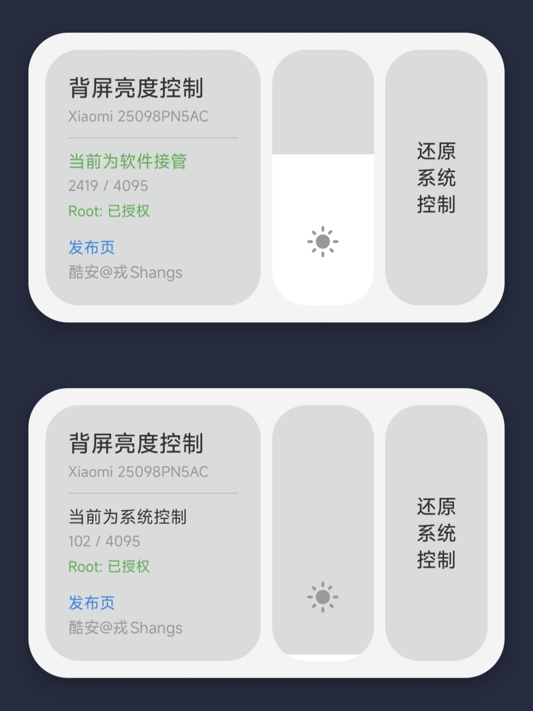

# 背屏激发

小米17 Pro / 17 Pro Max 背屏亮度控制工具。Root 权限下，通过直观的滑块调节背屏亮度，支持一键锁定或恢复系统控制。

## 📱 应用界面



*全新的卡片式界面，类似控制中心磁贴设计*

## ✨ 核心特性

- **垂直亮度滑块** — 直观的滑块控件，拖动即可实时调节背屏亮度
- **自定义亮度值** — 支持精确输入亮度数值（0-4095）
- **一键切换状态** — 软件接管/系统控制，点击按钮即可切换
- **实时状态显示** — 当前亮度值、Root状态、设备型号一目了然
- **控制中心磁贴** — 下拉通知栏快速切换，无需打开 App
- **自动 Root 检测** — 启动时验证权限，未 Root 则提示退出

## 📋 适用环境

| 项目 | 说明 |
|------|------|
| 机型 | 小米17 Pro / 17 Pro Max |
| 系统 | HyperOS 3.0.313.0（已测试） |
| 权限 | Root（Magisk / KernelSU） |
| 背光路径 | `/sys/class/backlight/panel1-backlight/` |
| 亮度范围 | 0 - 4095 |

## 🔧 工作原理

直接操作内核背光接口：

```
/sys/class/backlight/panel1-backlight/brightness
/sys/class/backlight/panel1-backlight/max_brightness
```

- **软件接管**：通过滑块或输入框设置亮度值 → 写入 `brightness` 文件
- **锁定模式**：`chmod 444` 设为只读，系统无法自动调节
- **系统控制**：`chmod 644` 恢复可写，系统重新接管亮度调节

## 🚀 构建

```bash
./gradlew assembleRelease
```

输出：`app/build/outputs/apk/release/app-release-unsigned.apk`

建议使用 Android Studio 构建，签名后安装。

## 📦 下载

| 版本 | 文件 | 说明 |
|------|------|------|
| v1.2 | [app-release-new.apk](website/app-release-new.apk) | 新增亮度滑块，全新界面 |
| v1.1 | [app-release-v1.1.apk](website/app-release-v1.1.apk) | 新增控制中心磁贴 |
| v1.0 | [app-release.apk](website/app-release.apk) | 首个发布版本 |

推荐签名后安装

## 📝 许可

MIT License

## 🔗 链接

- 开发者博客：[rongshangs.top](http://rongshangs.top)
- 官网：[bright.rongshangs.top](http://bright.rongshangs.top)
