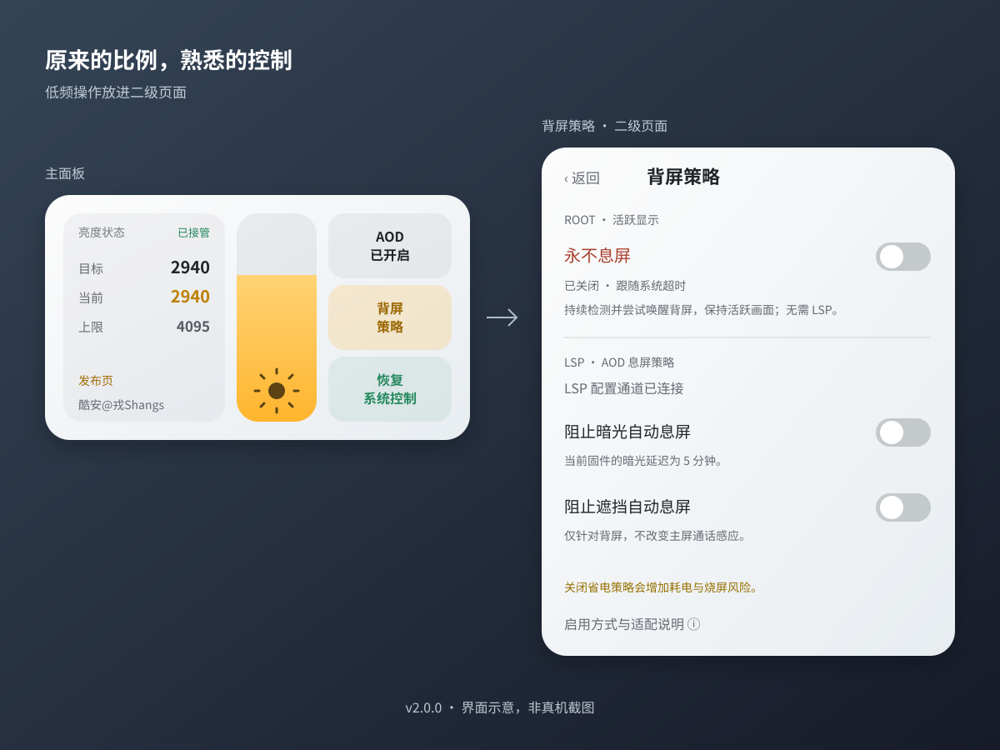

# 背屏激发

小米 17 Pro / 17 Pro Max 背屏亮度控制工具，需要 Root。支持手动亮度、背屏 AOD、永不息屏和控制中心入口；界面随系统深浅色切换。

> **v2.0.0** 新增可选的 LSPosed 背屏暗光、遮挡息屏拦截，并将永不息屏与 LSP 开关集中到“背屏策略”页。原有亮度与 AOD 控制仍只需 Root，不强制安装 LSP。

> v1.6 起更换发布签名，不能覆盖安装 v1.5 及更早版本。请先在旧版恢复系统控制，再卸载安装。后续版本沿用同一发布密钥。

## 界面与功能



- 手动亮度最低 10，上限读取设备节点；面板显示当前值与目标值。
- AOD、永不息屏独立控制；恢复系统控制会停止守护、恢复正常息屏超时，不改变 AOD 开关。
- 永不息屏复用亮度守护的 C 进程，检测背屏息屏后尝试唤醒；可能短暂黑屏，不保证系统限制下始终有效。
- 控制中心入口使用 Activity 面板，后方应用可能暂停；桌面入口使用悬浮窗，需要悬浮窗权限。
- 点击空白关闭，支持横屏布局、深浅色和渐变；Android 12+ 在系统允许时使用跨窗口模糊。
- 主面板保留原有短卡片比例，右侧黄色“背屏策略”进入二级页面：Root 活跃显示组提供“永不息屏”，LSP AOD 策略组提供暗光与遮挡息屏拦截。不安装 LSP 时仅禁用 LSP 两项，不影响 Root 控制。酷安入口为“酷安@戎Shangs”。

开启永不息屏会增加耗电与烧屏风险。卸载前务必恢复系统控制：独立 Root 进程不会因关闭面板或杀掉 App 自动退出。

### 2.0 可选 LSP 功能

1. 使用支持 libxposed API 101 和远程配置的 LSPosed，启用“背屏控制”模块。
2. 作用域仅选择“背屏中心” `com.xiaomi.subscreencenter`，不要勾选系统框架、SystemUI 或全部应用。首次启用或更新模块后重启手机；覆盖安装 APK 不会替换已加载到背屏中心的模块代码。仅切换开关不需要重启。
3. 点击主面板右侧黄色“背屏策略”，二级页面显示“LSP 配置通道已连接”后分别设置两个 LSP 开关；该状态仅表示配置通道与作用域检查通过，不是对其他固件的兼容保证。“启用方式与适配说明”可查看说明；返回按钮或返回键回到主面板，点击空白关闭整个面板。

已在用户的 pandora / OS4.0.0.41.XBLCNXM / Android 17、LSPosed 2.2.0 (7854) 上取得两条拦截日志，用户确认功能正常。目标背屏中心为 `RELEASE-1.0.2608211912`，其他固件尚未验证。该固件暗光延迟为 **5 分钟**，不是固定 3 分钟；开关按实际暗光策略拦截，不依赖时间猜测。目标结构不匹配时保留系统原行为并记录 LSP 日志，不尝试全局阻止息屏。

两个 LSP 开关只针对背屏 **AOD** 的暗光、遮挡路径，不会把 AOD 改成活跃画面，也不拦截电源键、双击、热保护或其他定时策略。它们与同页的 Root“永不息屏”独立。开关通过 LSP 保存，不需要 App 常驻；目标进程内只检查已发生的传感器/定时器回调，不新增轮询、线程或唤醒锁。减少背屏省电行为仍会增加屏幕耗电与烧屏风险，不能宣称零功耗。

配置会供后续相关事件使用。为避免误唤醒手动关闭的背屏，切换时不主动点亮；如果背屏已经关闭，或关闭拦截后需立即重置原有状态，请重新唤醒背屏。恢复系统控制会同时尝试关闭两个 LSP 开关；配置保存失败会单独提示，不谎报全部恢复。卸载模块前先关闭开关并恢复系统控制。

定位证据、边界与真机验收步骤见 [2.0 接入记录](docs/2.0-hook-analysis.md)。

## 当前运行机制

```text
面板操作 → 单一控制队列 → 复用 su 会话 → Root 私有目录中的 C 程序
                                           ├─ 本地 socket 更新目标，不重启守护
                                           ├─ 仅亮度：正常 4 秒，异常后 1 秒检查
                                           └─ 常亮：另每 2 秒查询背屏并按需唤醒

恢复系统控制 → 守护确认退出 → 节点恢复可写、亮度 500
                           → 自动息屏时间恢复 10000
                           → LSP 两项均确认关闭后关闭面板

可选 LSP 开关 → 框架远程配置 → 已有背屏中心进程
                              ├─ 暗光：拦截低光事件及专属延迟定时器
                              └─ 遮挡：拦截背屏 non-UI 传感器 near 事件
```

### 亮度与省电

亮度节点为 `/sys/class/backlight/panel1-backlight/brightness`，上限读取同目录的 `max_brightness`。守护写入时临时设为 `644`，写完设回 `444`。HyperOS 仍可能通过其他显示链路覆盖亮度，因此权限锁定不能代替轮询校正。

| 模式 | 面板关闭后的工作 |
|---|---|
| 系统控制、常亮关闭 | 不保留 C 守护，不进行周期检查 |
| 仅亮度接管 | 一个 C 进程，正常每 4 秒直接读取节点；不查询显示状态、不持有唤醒锁 |
| 永不息屏 | 同一个 C 进程额外查询显示状态，并续期唤醒锁，功耗明显高于仅调亮度 |

面板可见时每 500ms 刷新亮度，优先直接读节点，无法访问时复用 su；守护健康状态每 5 秒检查一次。面板关闭、控制操作完成且状态保存后，主动退出 App 主进程，需要守护时仅保留独立 C 程序。系统仍绑定磁贴时暂缓退出，避免反复拉起；重新打开面板会取消旧退出任务。恢复系统控制会同时停止 C 守护。

本次实现没有真机功耗实测数据，不沿用旧版的 CPU、内存数字作为新版本保证。

### 永不息屏

- 系统设置 `subscreen_display_time=2147483647`，关闭时恢复 `10000`。
- C 进程通过 `cmd display get-displays` 识别 Display 1 的状态；OFF、DOZE、DOZE_SUSPEND、ON_SUSPEND 时执行 `input -d 1 keyevent KEYCODE_WAKEUP`。
- 使用 6 秒有效期的内核唤醒锁并持续续期，使主屏关闭后仍可检测。正常关闭立即释放；进程被强杀后锁自动到期。
- 查询或唤醒失败时释放锁，并按 4/8/16/32 秒退避重试，亮度守护继续工作。面板显示守护异常，不能把“设置已写入”当作“守护正常”。
- 依赖设备的显示状态输出、Display 1 编号和 `/sys/power/wake_lock` 支持，需要真机验证。
- 不新增开机常驻服务。重启会终止 C 进程，但系统超时设置可能保留；再次打开面板时按当前设备状态恢复守护。在此之前不保证主动唤醒功能。

### 安全与异常处理

- 程序及控制文件位于 Root 专属 `/data/adb/bright`，目录权限 `700`；socket 验证客户端 UID，文件锁防止重复守护，不信任共享目录 PID 文件。
- 二进制安装校验 SHA-256，更新前等待旧守护退出，通过临时文件原子替换，避免覆盖正在执行的文件。
- 亮度更新走 socket，不重复复制、杀进程与启动。恢复必须确认守护退出后才能写系统状态，避免旧任务反向接管。
- 控制操作串行执行；过期亮度任务失效。Root 命令超时会销毁会话，不自动重放可能已经生效的写入。
- 状态读取失败显示未知或异常，不伪造亮度数值；备份排除设备控制状态及本机二进制。

## 构建与验证

需要 JDK 17、Android SDK 36、NDK `28.2.13676358`。targetSdk 仍为 35，最低 Android 8.0 不变。Gradle 会自动将 C 源码编译为静态 ARM64 资产，纳入 APK 构建，编译警告作为错误处理。

```powershell
.\gradlew.bat testDebugUnitTest lintDebug assembleRelease
```

配置本地发布密钥后输出 `app/build/outputs/apk/release/app-release.apk`；未配置时需要自行签名。当前源码版本 `2.0.0`（versionCode 24）。

单元测试覆盖 Root 会话复用、输出分片、超时、中断、不重放写入、控制队列顺序、过期任务、守护状态解析，以及 LSP 事件筛选、开关独立性与其他定时器隔离。原生解析测试可在有 GCC 的主机执行：

```sh
gcc -std=c11 -Wall -Wextra -Werror app/src/test/native/watchdog_logic_test.c -o build/watchdog_logic_test
./build/watchdog_logic_test
```

这些检查不能替代真机测试：需验证连续拖动后立即恢复、反复开关常亮、关闭面板、旋转屏幕、电源键/双击息屏、遮盖恢复，以及长时间待机功耗。

## 下载与签名

[GitHub Releases](https://github.com/RongShangs/bright/releases) · [官网](https://bright.rongshangs.top)

下载 [v2.0.0](https://github.com/RongShangs/bright/releases/tag/v2.0.0)，详细更新内容见 Release 页面。

- v1.6 起发布证书 SHA-256：`4B041D7BA17FCF2121896E136AC906CDE1CF02C8061792584E7CE961439B38D8`
- 旧版证书 SHA-256：`A40DA80A59D170CAA950CF15C18C454D47A39B26989D8B640ECD745BA71BF5DC`

## 许可

MIT License
